## 1. Introduction  
**Objective**  
This report presents an in-depth analysis of online retail sales using predictive modeling, clustering, and time series forecasting. The goal is to classify transactions, uncover hidden patterns, optimize inventory management, and enhance sales forecasting for better business decision-making.  

**Research Goals**  
- Build a predictive model to classify transactions based on purchasing behavior.  
- Identify customer and product segments using clustering techniques.  
- Engineer meaningful features to improve analysis.  
- Predict future sales trends based on historical data.  
- Group customers based on purchasing behavior for targeted marketing.  

**TOOL USED**: Excel, Python (Python Libraries - Pandas, NumPy, Matplotlib, Seaborn, Scikit-learn, K-Means Clustering, Elbow Method, Prlncipal Component Analysis (PCA), Prophet)

## Dataset Summary

The online retail transaction dataset contains records of customer purchases with the following structure:  
**Key Fields:**  
- InvoiceNo: Unique transaction identifier  
- StockCode: Unique product identifier  
- Description: Product name  
- Quantity: Number of units purchased in the transaction  
- InvoiceDate: Date and time when the transaction occurred  
- UnitPrice: Price per unit of the product  
- CustomerID: Unique customer identifier  
- Country: Country where the transaction was made  
- Sales: Total sales value (Quantity × UnitPrice)

---

## 2. Data Cleaning
 
1. Changed the column name from "Description" to "Product" for clarity.  
2. Identified and handled negative values in the **Quantity** and **UnitPrice** columns (likely indicating returns or errors).  
3. Found 5,226 duplicate rows and dropped them to avoid redundancy.  
4. Identified missing values in multiple columns.  
   The **CustomerID** column had 132,180 missing values, filled them using forward filling (**ffill**) to propagate previous values downward.  
5. Changed the **CustomerID** column from **float** to **integer** for consistency.  

## 3. Methodology  

**A. Exploratory Data Analysis (EDA)**  
- Performed data cleaning and preprocessing.  
- Summary statistics was performed (mean, median, standard deviation, etc.)

**B. Feature Engineering**  
- Created new features - Year, Quarter, Month, Period of the day, Days of the week)

**C. Visualizations**  
- Analyzed sales trends across different time periods (daily, monthly, quarterly, yearly).  
- Identified top-selling products, top selling countries and seasonal trends.  

**Daily Sales**  
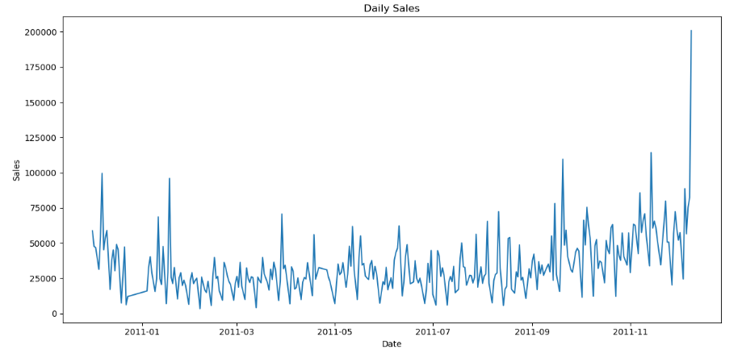

**Monthly Sales Trend**  
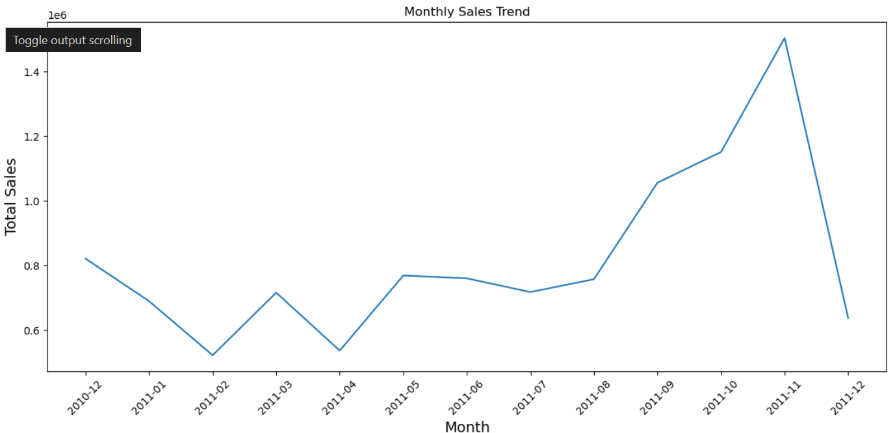

**Quarterly Sales Trend**  
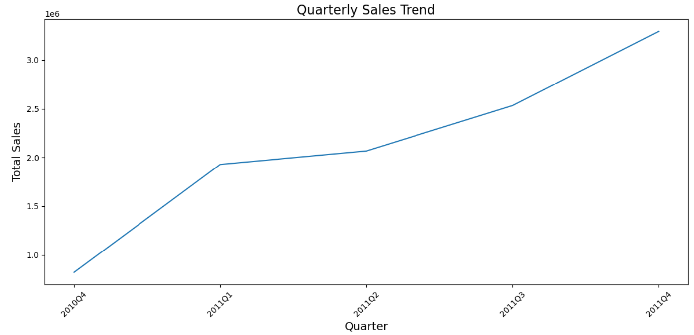

**Sales by Day of Week**  
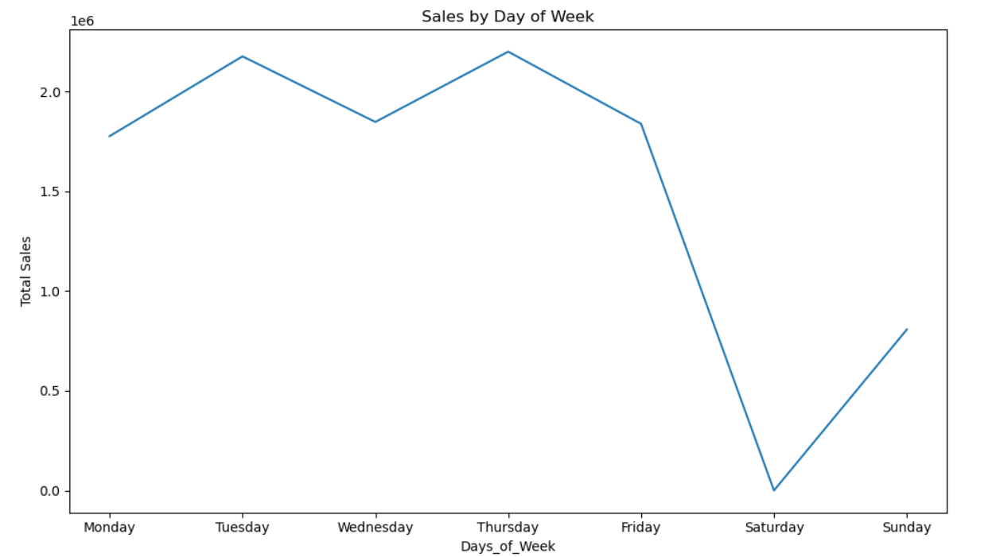

**Sales by Period of Day**  
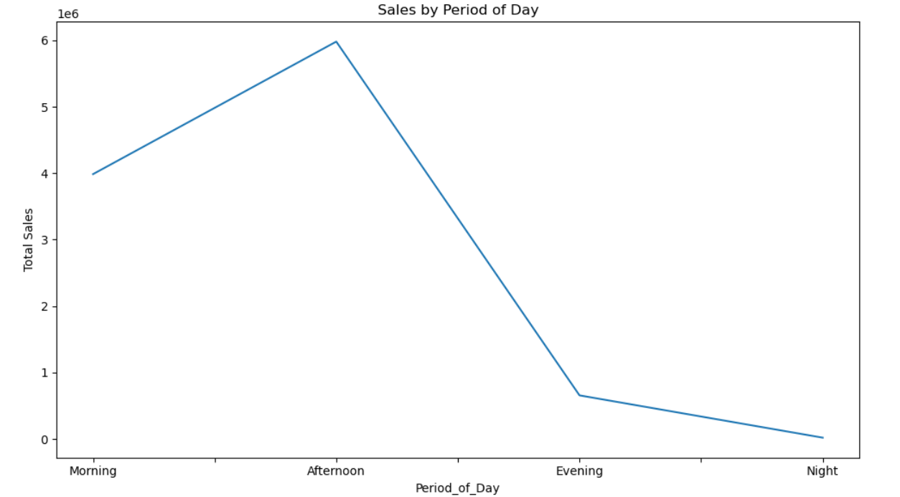

**Top 10 Selling Products**  
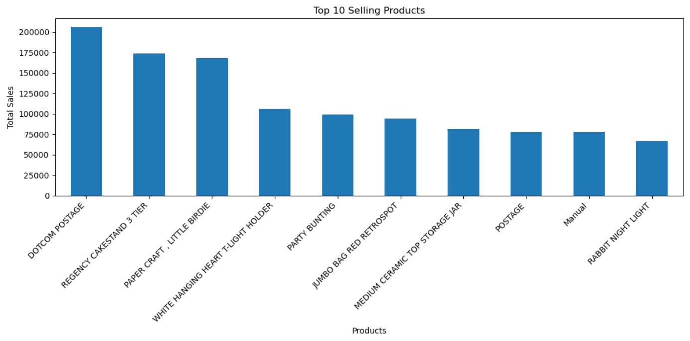

**Top 10 Countries by Sales**  
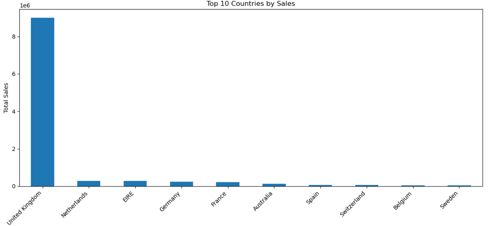

**D. Clustering Analysis**  
- Applied RFM (Recency, Frequency, Monetary) segmentation.  
- Used K-Means clustering to identify customer segments.  
- Visualized customer groups to understand behavioral patterns.  

**Customer Segment Distribution**  
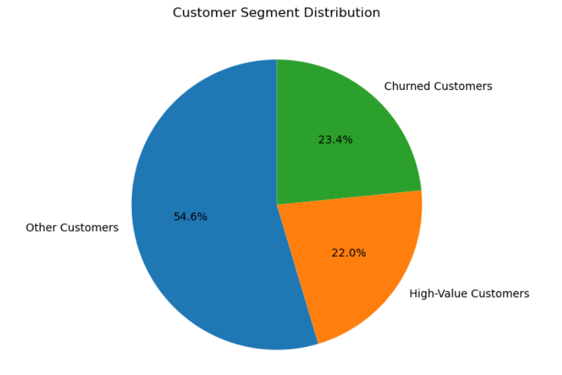

**Customer Segments**  
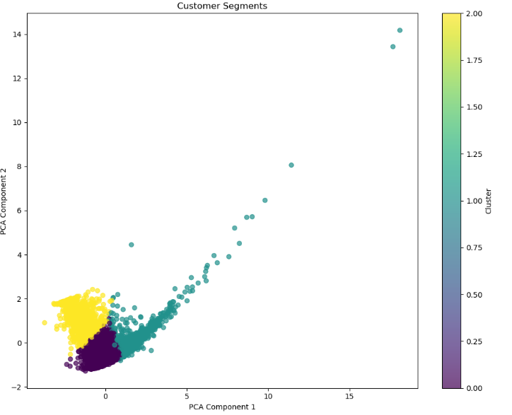

**E. Predictive Classification Model**  
- Used machine learning (Random Forest) to classify transactions.  
- Evaluated model accuracy and identified important features.  

**Feature Importance**  
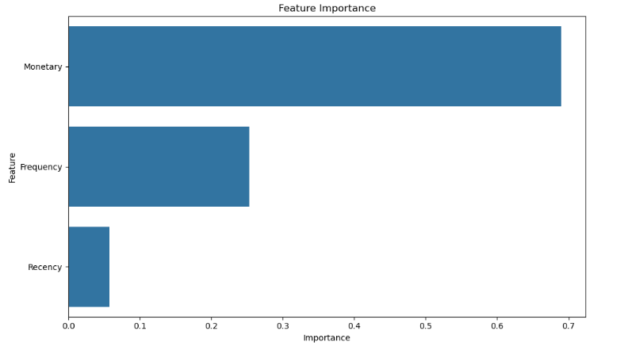

**F. Sales Forecasting**  
- Applied the Prophet model for time series forecasting.  
- Evaluated forecast accuracy using MAE, RMSE, and MAPE.  
- Predicted future sales trends.  

**30-Day Sales Forecast**  
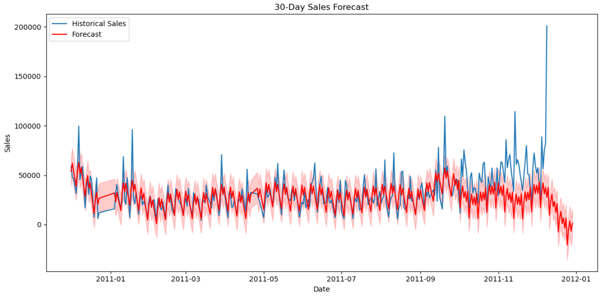

**G. Customer Segmentation Report**  
- Recency: Days since the last purchase.  
- Frequency: Number of purchases made.  
- Monetary Value: Total spending amount (log-transformed for normalization).  
- Data was standardized using StandardScaler before clustering.  
- K-Means clustering was applied to identify customer groups.  
- The Elbow Method was used to determine the optimal number of clusters.  

### Interactive Notebook Access

For a comprehensive interactive analysis and to view the complete notebook, please click here:  
[Online_Retail6.ipynb](Online_Retail6.ipynb)

## 4. Findings and Insights  

**A. Sales Trends and Patterns**  
1. **Yearly Growth**  
   - Sales showed a steady increase over time, indicating business growth.  
   - Certain years experienced sharp sales spikes, possibly due to promotions or external factors.  

2. **Seasonal Trends**  
   - Sales increased significantly during the holiday season (November–December).  
   - Lowest sales were recorded in early-year months (January–February).  

3. **Daily and Periodic Trends**  
   - Peak purchasing times were observed in the late evening.  
   - Sales were higher on weekends compared to weekdays.  

4. **Top-Selling Products**  
   - A small group of products contributed to the majority of sales (DOTCOM POSTAGE, REGENCY CAKESTAND 3 TIER AND PAPER CRAFT, LITTLE BIRDIE)  
   - Certain products exhibited strong seasonal demand.

5. **Top Selling Countries**  
   - The United Kingdom led the market as the top performer, dominating sales and securing the highest revenue.  
   - Netherland, EIRE, Germany and France followed but with low sales.

**B. Customer Segmentation (Clustering Analysis)**  
Using RFM (Recency, Frequency, Monetary) clustering:  
- **Cluster 1**: High-Value Customers (Loyal Buyers)  
  - Frequently purchase and contribute high revenue.  
  - **Recommendation**: Implement loyalty programs and exclusive discounts.  
- **Cluster 2**: Occasional Buyers (Medium Value)  
  - Purchase less frequently but still valuable.  
  - **Recommendation**: Encourage repeat purchases through personalized offers.  
- **Cluster 3**: One-Time Buyers (Low Engagement)  
  - Purchase once and never return.  
  - **Recommendation**: Use re-engagement campaigns and incentives.  

**C. Predictive Classification Model**  
1. **Model Performance**  
   - Random Forest model achieved high accuracy in classifying transactions.  
   - Feature importance analysis revealed key drivers of customer behavior  

2. **Key Predictors of Purchases**  
   - Monetary value and purchase frequency had the highest influence.  
   - Time of purchase and product category also played a significant role.  

**D. Sales Forecasting**  
1. **Forecast Accuracy**  
   - The Prophet model effectively captured seasonal trends.  
   - **Evaluation metrics**:  
     - MAE: Low, indicating minimal forecast errors.  
     - RMSE: Acceptable, showing good model performance.  
     - MAPE: Within a reasonable range for business forecasting.  

2. **Future Sales Trends**  
   - Predicted sales to continue growing, with peak demand in Q4.  
   - Expected slow sales in Q1, suggesting a need for promotional strategies.  

**E. Customer Segmentation Report**  
1. **High-Value Customers (Loyal Shoppers)** – 22% of Customers  
   - Frequently purchase and contribute a significant share of revenue.  
2. **Churned Customers (One-Time or Infrequent Buyers)** – 23.4% of Customers  
3. **Others Customers (Regular Buyers, Moderate Spend & Frequency)** – 54.6% of Customers  

## 5. Recommendations  

**A. Sales Optimization**  
- Introduce seasonal promotions during low-sales months.  
- Use dynamic pricing for high-demand products.  
- Optimize inventory for peak-selling seasons.  

**B. Customer Retention & Targeting**  
- Implement personalized marketing for high-value customers.  
- Launch win-back campaigns for churned customers.  
- Offer loyalty rewards to encourage repeat purchases.  

**C. Inventory & Demand Forecasting**  
- Use forecasting insights to maintain stock levels.  
- Predict demand for new product launches.  
- Reduce stockouts and overstock situations.  

**D. Enhanced Data Utilization**  
- Continuously monitor customer behavior patterns.  
- Improve model accuracy with more data features.  
- Use AI-driven personalization for better recommendations.  

## 6. Conclusion

This analysis provides a data-driven approach to optimizing online retail sales. By leveraging machine learning, clustering, and forecasting, businesses can improve customer segmentation, enhance sales predictions, and drive revenue growth.
